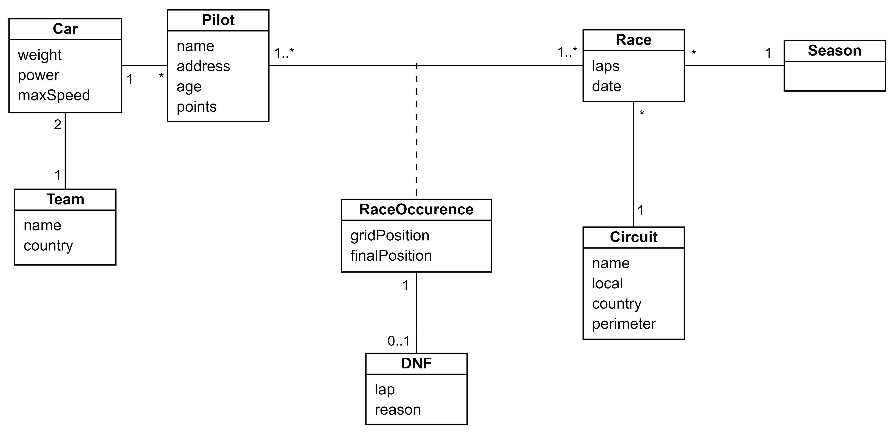
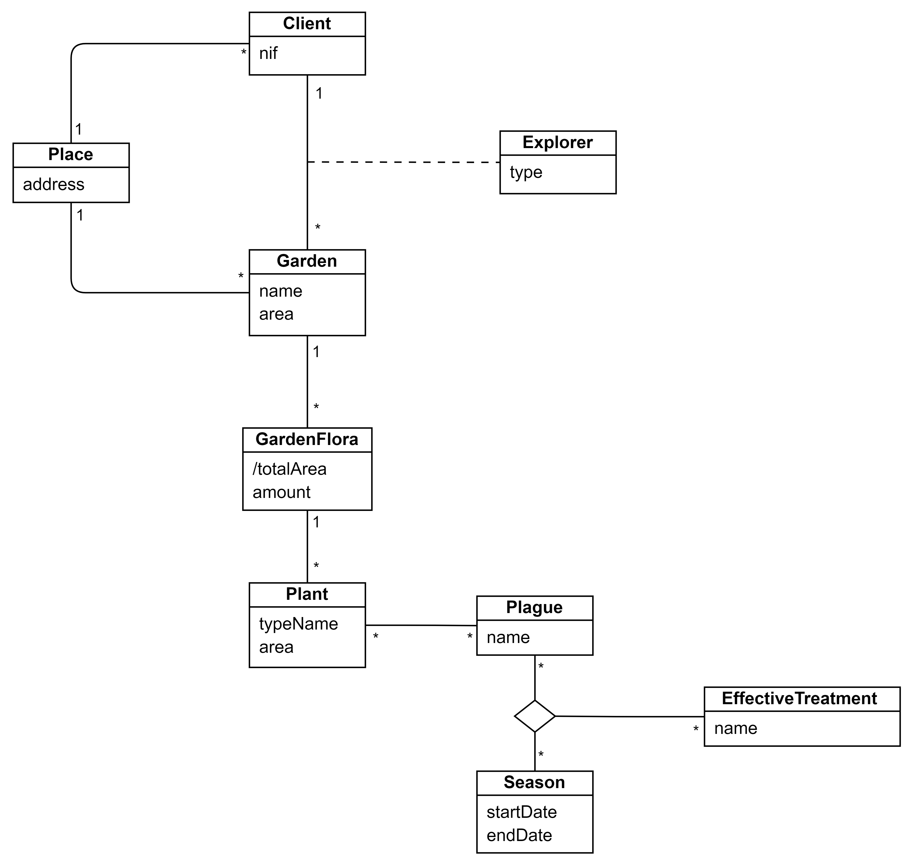
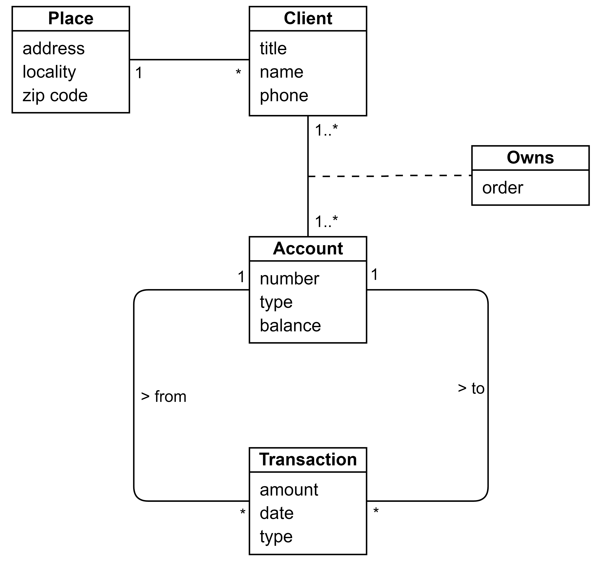

# Conceptual Modeling<!-- omit in toc -->

Exercise sheet available [here](https://moodle.up.pt/pluginfile.php/150335/mod_resource/content/5/01.BD-P-MC-ENG.pdf).

## Table of contents<!-- omit in toc -->

- [1. Formula 1](#1-formula-1)
- [2. Gardener](#2-gardener)
- [3. Bank](#3-bank)

---

## Exercises<!-- omit in toc -->

### 1. Formula 1

### 2. Gardener

### 3. Bank

